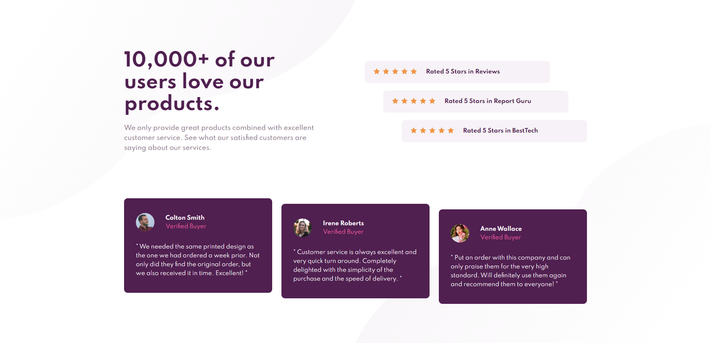

# Frontend Mentor - Social proof section solution

This is a solution to the [Social proof section challenge on Frontend Mentor](https://www.frontendmentor.io/challenges/social-proof-section-6e0qTv_bA).
### The challenge

Users should be able to:

- View the optimal layout for the section depending on their device's screen size

### Links

- [Solution URL](https://github.com/Fernando-Lz/social-proof-section)
- [Live Site URL](https://fernando-lz.github.io/social-proof-section/)

### Built with

- Semantic HTML5 markup
- CSS custom properties
- Flexbox
- CSS Grid

### Screenshots
Desktop version:
---

Mobile version:
---
